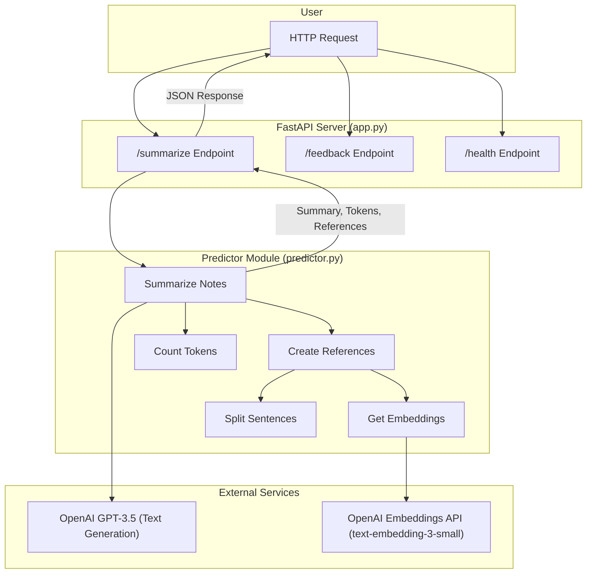

# Medical Text Summarizer

This repository contains a proof-of-concept medical text summarization system to help clinicians quickly understand patient cases.



## 1. Specification of dependencies

This code requires Python 3.10. Clone the repo, then install the requirements by:

```
# clone repo
git clone https://github.com/hasibzunair/medical-text-summarizer
cd medical-text-summarizer
# create fresh env
conda create -n mts python=3.10     
conda activate mts
# install reqs
pip install -r requirements.txt
```

## 2. Create API

First, create a `.env` file in the project folder and add the `OPENAI_API_KEY` by:

```bash
OPENAI_API_KEY=your_api_key
```

Then, build the docker image and run it locally by:
```bash
# go to api source code
cd src/
# build image
docker buildx build -t medtext-summarizer:v1 --platform Linux/amd64 .
# run container
docker run -p 8000:8000 --env-file ../.env --name medtext-api medtext-summarizer:v1
```

## 3. Interact with the API

Create a folder `datasets` in the root folder and add the `*.txt` notes in a subfolder called `notes`.

Then, to interact with the API, on a separate terminal in the root folder, run:
```bash
python request.py
```

This runs POST `/summarize`, GET `/health`, POST `/feedback`.

## 4. Run tests

To run tests, in the terminal, run the command:
```bash
python -m pytest ./tests
```

## Acknowledgements

This code use the OpenAI API.